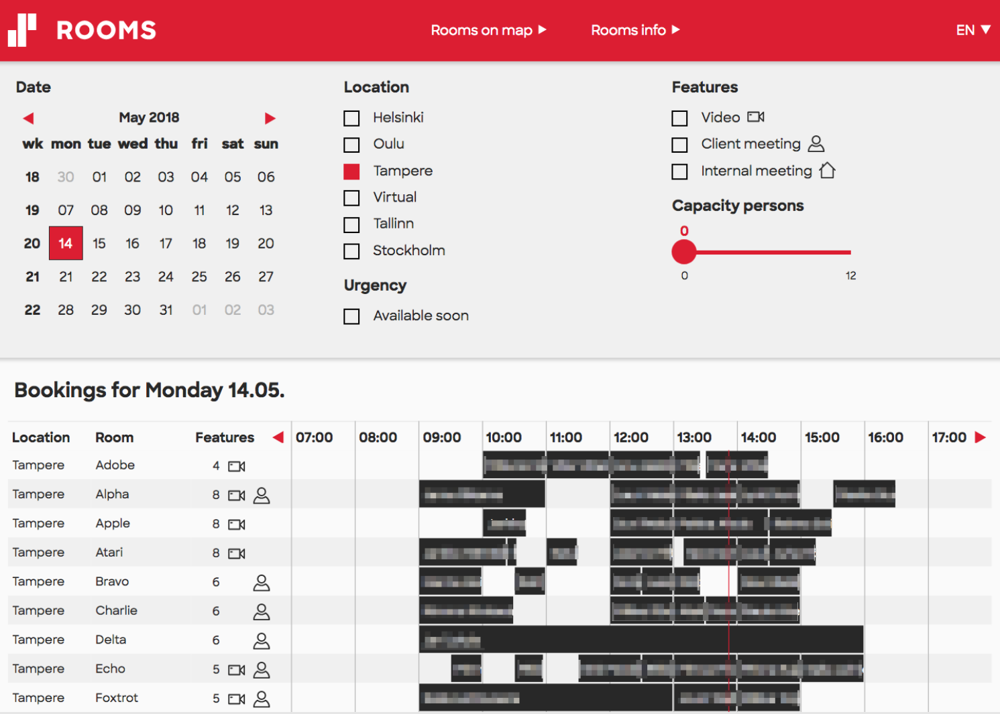

*Notice:* Solita does not maintain this project anymore.

# General

This application can be used to view Microsoft Exchange room bookings in a simple web interface.

More information and configuration help available here:
- frontend/README.md
- backend/README.md

# Authors

Created by: Solita Oy

* Written by: Jari "Jarzka" Hanhela
* Current visual design by: Tero "Mappe" Malinen
* Previous visual design by: Heikki Niemi

# License

The code in this repository is released under The MIT License. Images, fonts, icons and other assets are explicitly excluded.

Some of the font and icon files in this repository are explicitly licensed to Solita Oy. If you want to use this application in your own environment, you have to either get a license for those assets, or configure the application to use the free alternative font and icon files (more info in the frontend README.md file).
